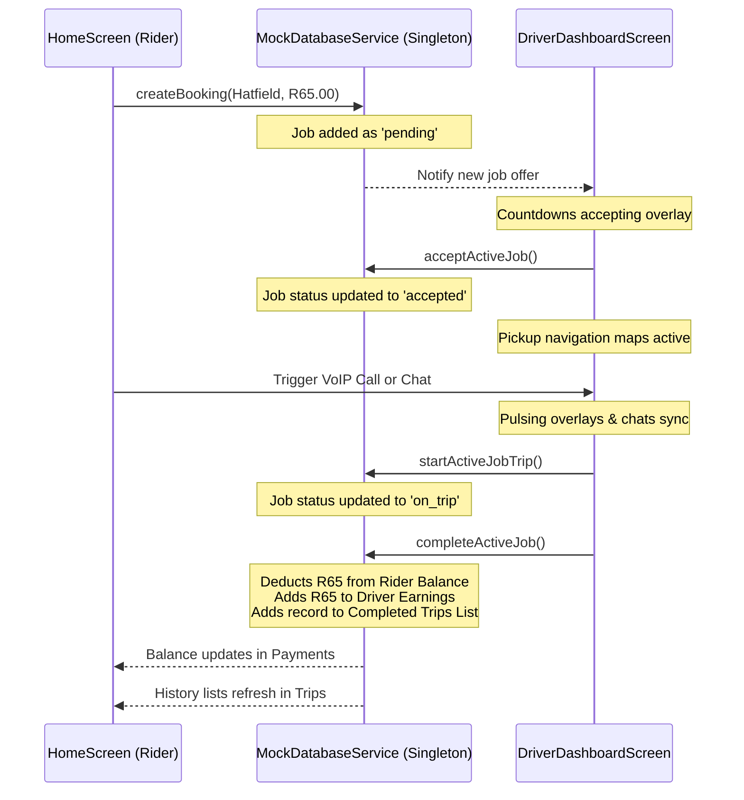

# SupplyWave Mobility Ecosystem 🚗🇿🇦
### Developed for Kirov Dynamics Technology — Pretoria, South Africa

[](https://flutter.dev)
[](https://dart.dev)
[](https://opensource.org/licenses/MIT)
[](http://makeapullrequest.com)

SupplyWave is a state-of-the-art, high-fidelity interactive mobility platform built with Flutter. By connecting a responsive passenger portal and a dark-mode driver dispatch terminal via a unified reactive state layer, SupplyWave provides a fully operational, end-to-end dispatch-receive simulation suited for the South African market.

---

## 🏗️ System Architecture & Reactive Flow



---

## 📱 Premium Screen Modules & Dynamic Additions

The application features nine primary, production-grade screens and interactive overlays:

### 1. Vector Map Passenger Portal (`HomeScreen`)
*   **Dynamic Custom Maps**: Renders a custom vector map using high-performance `CustomPainter` lines representing roads, parks, rivers, and a pulsing passenger pin.
*   **Live Moving Drivers**: Places multiple simulated driver markers drifting around Hatfield and Pretoria Central in real time.
*   **Surge & Ride Options**: Multi-tier pricing structures (*Wave Go*, *Wave Premium*, *Wave XL*) calculating Pretoria Rand fares dynamically.

### 2. Dark-Mode Dispatch-Receive Terminal (`DriverDashboardScreen`)
*   **Demand Surge Zones**: Sleek grid layout painting red-to-purple hotzones representing Pretoria East's high-surge areas.
*   **Pulsing Job acceptance HUD**: Sliders to toggle online state which trigger incoming passenger countdown rings, displaying passenger profile metrics, destination, and payout estimates.
*   **Active Route Steps**: Displays real-time navigations ("Head north on Festival St") and lets drivers cycle through trip completion steps (Accept ➔ Arrive ➔ Start ➔ Complete).

### 3. Glassmorphic VoIP Calling Console (`VoipCallOverlayWidget`)
*   **Aesthetic Frosted Overlay**: Full-screen layout applying `ImageFilter.blur` over a midnight-blue console backdrop.
*   **Pulsing Ripple Radiations**: Multi-layered circular ripples pulsing outwards from the passenger/driver profile picture.
*   **Active Stopwatch Ticker**: An automated stopwatch starting the moment call status connects. Fully stateful mute, speaker, and video toggle icons.

### 4. Interactive Auto-Reply Messenger (`SimulatedChatSheetWidget`)
*   **Autoscroll Timeline**: Animated message bubble lists highlighting passenger (primary blue) and driver (translucent gray) text lines.
*   **Quick Composer Chips**: Fast text pills ("I am outside now", "Almost there!") for immediate dispatch updates.
*   **Intelligent Auto-Replies**: Text replies automatically launch a 2-second mock delay timer before prompting a realistic driver reaction.

### 5. Premium Wallet & Presets Top-Up (`WalletBalanceHeroWidget`)
*   **Live Balance Deductions**: Monitors passenger funds. Completing a driver ride deducts the fare instantly.
*   **Presets Top-Up Sheets**: Bottom sheet allowing users to add Pretoria Rand balances using direct presets (`R 50`, `R 100`, `R 200`) with visual alerts on success.

### 6. Neon Laser Credit Card Scanner (`AddPaymentMethodSheetWidget`)
*   **Viewfinder Overlay**: Activated via a camera icon inside the Card Number field.
*   **Panning Scan Ticker**: A glowing green neon scanning laser panning up and down inside the viewfinder frame.
*   **Autofill Decoder**: Automatically decodes a mock card, populates names/numbers, closes scanner, and displays confirmation notifications.

### 7. Collapsible Developer "Simulation HUD" (`DeveloperCheatConsoleWidget`)
*   **Floating Simulator Panel**: Collapsible gear button displaying floating neon-cyan menus to trigger mock occurrences on the fly.
*   **Manual Trigger Options**: Inject cash, force a driver ride request match, advance trip phases, or test arrived/surge alerts.

### 8. Global Banner Notifications (`InAppNotificationBannerWidget`)
*   **Spring Bounce Alerts**: Top-down sliding banners notifying the user of balance transactions, driver matching, and surge notifications.
*   **Universal Listener**: Hooks directly into the system database notifier to print overlays across Home, Driver, and Payments pages.

---

## 🗂️ Code Structure Outline

```text
lib/
├── core/
│   ├── app_export.dart               # Theme and sizer asset bindings
│   └── services/
│       └── mock_database_service.dart # Thread-safe singleton synchronizer
├── presentation/
│   ├── home_screen/                  # Vector map, destination card, search
│   ├── driver_dashboard/             # Dark-mode surge maps, job accept rings
│   ├── trips_screen/                 # Spend history logs & analytics charts
│   ├── payments_screen/              # Financial ledgers & balance widgets
│   │   └── widgets/
│   │       ├── wallet_balance_hero_widget.dart # Rand top-up selector
│   │       └── add_payment_method_sheet_widget.dart # Laser card scanner overlay
│   ├── profile_screen/               # Passenger profile & driver toggle pill
│   └── sign_up_login_screen/         # Onboarding credential entries
├── widgets/
│   ├── custom_icon_widget.dart
│   ├── voip_call_overlay_widget.dart       # Pulsing full-screen VoIP widget
│   ├── simulated_chat_sheet_widget.dart    # Autoscroll compose chat widget
│   ├── in_app_notification_banner_widget.dart # Glassmorphic slide notifications
│   └── developer_cheat_console_widget.dart    # Collapsible neon simulation HUD
└── routes/
    └── app_routes.dart               # Registered screen mapping
```

---

## 🚀 Quick Start

1. Install Flutter dependencies:
   ```bash
   flutter pub get
   ```
2. Launch your emulator or run:
   ```bash
   flutter run
   ```

---

## 🤝 Contributing & Community

We are actively looking for developers, designers, and beta testers to grow the SupplyWave Mobility network in South Africa! 

### How to get involved:
- **Join the Discussion**: Share your ideas for new routes, transit models, or payment gateways.
- **Submit PRs**: We love contributions! Read our contribution guidelines to start resolving open issues.
- **Contribute Translation/Localization**: Help us bring SupplyWave to all official South African languages.

---

## ❤️ Sponsors & Backing

Your sponsorships keep Kirov Dynamics' research and development running. Join our growing community of supporters!

- **GitHub Sponsors**: [Become a Sponsor](https://github.com/sponsors/Raphasha27)
- **OpenCollective**: [Support Kirov Dynamics](https://opencollective.com/kirov-dynamics)

*Built with ❤️ by Kirov Dynamics.*
